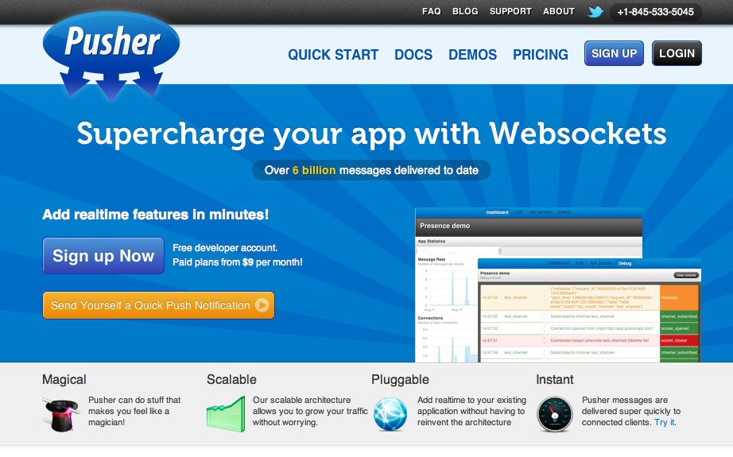

!SLIDE center

# Pusher #

 
!SLIDE 
 
# Pusher Example JS #

	@@@ javascript
		var pusher = new Pusher('API_KEY');
		var myChannel = pusher.subscribe('MY_CHANNEL');

		myChannel.bind('thing-create', function(thing) {
		  alert('A thing was created: ' + thing.name);
		});

!SLIDE 

# Pusher Example Ruby #
    
	@@@ ruby
		require 'pusher'

		Pusher.app_id = 'APP_ID'
		Pusher.key = 'API_KEY'
		Pusher.secret = 'SECRET_KEY'

		class ThingsController < ApplicationController
		  def create
		    @thing = Thing.new(params[:thing])

		    if @thing.save
		      Pusher['things'].trigger('thing-create', @thing.attributes)
		    end
		  end
		end