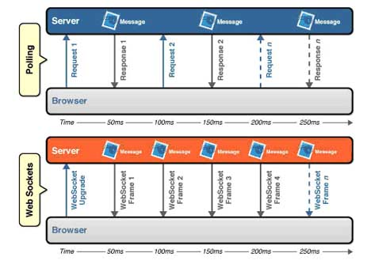

!SLIDE center

# Push vs Poll #

.notes Think about a webpage that requires frequent updates; For example think about a page that provides current stock prices, or scores for sports games, or a live blog event. 
.notes With polling, the browser sends HTTP requests at regular intervals and immediately receives a response.
.notes With Push via WebSockets the browser sets up the socket, then the server can send messages when ever it needs to.

 
*Example taken from: http://soa.sys-con.com/node/1315473*

!SLIDE smaller

# Sample request/response header #
	@@@
		GET /PollingStock//PollingStock HTTP/1.1
		Host: localhost:8080
		User-Agent: Mozilla/5.0 (Windows; U; Windows NT 5.1; en-US; rv:1.9.1.5) Gecko/20091102 Firefox/3.5.5
		Accept: text/html,application/xhtml+xml,application/xml;q=0.9,*/*;q=0.8
		Accept-Language: en-us
		Accept-Encoding: gzip,deflate
		Accept-Charset: ISO-8859-1,utf-8;q=0.7,*;q=0.7
		Keep-Alive: 300
		Connection: keep-alive
		Referer: http://www.example.com/PollingStock/
		Cookie: showInheritedConstant=false; showInheritedProtectedConstant=false; 
		  showInheritedProperty=false; showInheritedProtectedProperty=false; 
		  showInheritedMethod=false; showInheritedProtectedMethod=false; s
		  howInheritedEvent=false; showInheritedStyle=false; showInheritedEffect=false

		HTTP/1.x 200 OK
		X-Powered-By: Servlet/2.5
		Server: Sun Java System Application Server 9.1_02
		Content-Type: text/html;charset=UTF-8
		Content-Length: 21
		Date: Sat, 07 Nov 2009 00:32:46 GMT

!SLIDE smbullets incremental left
.notes now consider taking this up to 100,000 req/sec; thats 665 Mbps for our polling overhead, and 1.52 Mbps for the push overhead

# Cost of Polling #

*	Push WebSocket has ~ 2 byte overhead per message!
*	Polling Request/Response Header size ~ 871 bytes overhead per poll

* &nbsp;
*	**Poll:** *1000 clients polling 1 / second = 1000 * 871 = 871,000 bytes*
*	     6,968,000 bits per second... 6.6 Mbps
* &nbsp;
*	**Push:** *1000 clients receiving  1 / second = 1000 * 2 = 2,000 bytes*
*	     16,000 bits per second! 0.015 Mbps

